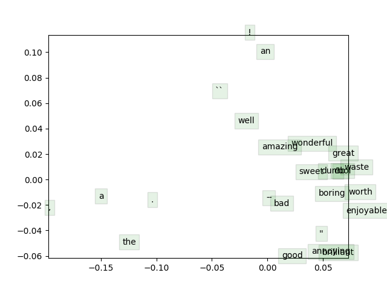

# word2vec

Implementation of two word2vec algorithms from scratch: skip-gram (with negative sampling) and CBOW (continuous bag of words).

No machine learning libraries were used. All gradients and cost functions are implemented from scratch. I provide various "sanity-check" tests for all main functionalities implemented.

Important: the entire project and implementation are inspired by [Stanford's course "Deep Learning for NLP" (2017)](https://web.stanford.edu/class/archive/cs/cs224n/cs224n.1174/). The tasks can be found at [this address](http://cs224d.stanford.edu/assignment1/index.html).

The word vectors are trained on the Stanford Sentiment Treebank (SST). Stochastic gradient descent is used for updating. The entire training process (roughly 40,000 iterations) will take ~3 hours on a standard machine (no GPUs). These word-vectors can be used to perform a (very simple) sentiment analysis task. Alternatively, pre-trained vectors can be used.

### List of requirements
* [python](https://www.python.org/downloads/) (tested with 2.7.12)
* [numpy](https://github.com/numpy/numpy) (tested with 1.15.4)
* [scikit-learn](https://github.com/scikit-learn/scikit-learn) (tested with 0.19.1)
* [scipy](https://www.scipy.org) (tested with 1.0.0)
* [matplotlib](https://github.com/matplotlib/matplotlib) (tested with 2.1.0)

### How to run

1. To download the datasets: 
```bash
chmod +x get_datasets.sh
./get_datasets.sh
```
to 
2. To train some word embeddings:
```bash
python word2vec.py
```
3. To perform sentiment analysis with your word vectors:
```bash
python sentiment_analysis.py --yourvectors
```
4. To perform sentiment analysis with pretrained word vectors (GloVe):
```bash
python sentiment_analysis.py --pretrained
```

### Vector space



### Licence

All my source code is licensed under the MIT license. Consider citing Stanford's Sentiment Treebank if you use the dataset. If you are using this code for purposes other than educational, please acknowledge Stanford's course as they were the initiators of the project, providing many core parts included in the current implementation.

### Resources

- [Videos for Stanford's Deep Learning for NLP course (Winter 2017)](https://www.youtube.com/playlist?list=PL3FW7Lu3i5Jsnh1rnUwq_TcylNr7EkRe6)
- [Current page of the course (Winter 2019)](http://web.stanford.edu/class/cs224n/)
- [Syllabus (Winter 2017) on which the current implementation for the first assignment relies on](https://web.stanford.edu/class/archive/cs/cs224n/cs224n.1174/syllabus.html)
- [Chris McCormick's explanation of skip-gram](http://mccormickml.com/2016/04/19/word2vec-tutorial-the-skip-gram-model/)
- [Stanford's Sentiment Treebank](https://aclanthology.info/papers/D13-1170/d13-1170)
